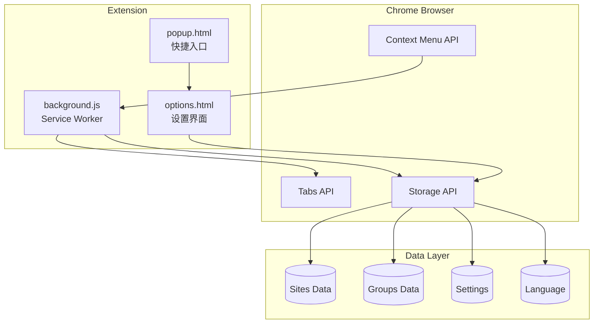
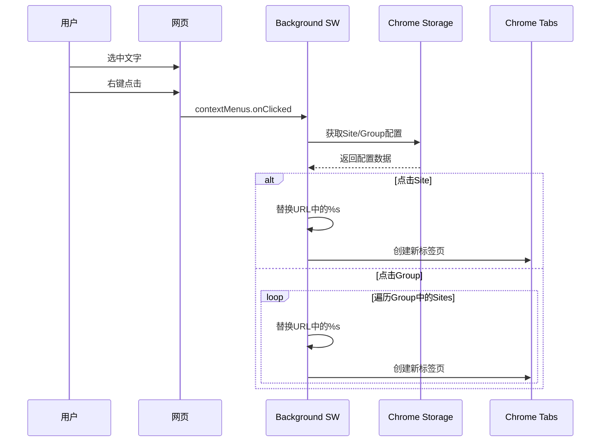
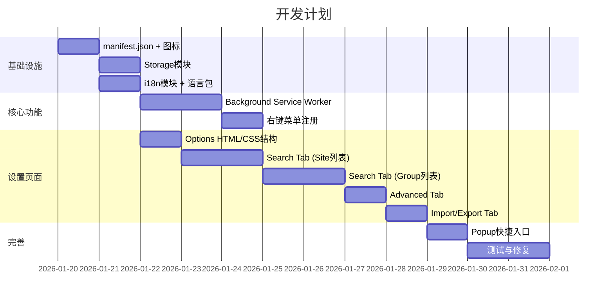

# 右键搜索 Chrome 插件 - 架构设计文档

> **版本**: v1.0  
> **日期**: 2026-01-20  
> **作者**: 首席架构师  
> **状态**: 待审批

---

## 1. 项目概述

### 1.1 项目目标
开发一个Chrome浏览器插件，允许用户选中网页文字后通过右键菜单快速在多个搜索引擎/网站中搜索。

### 1.2 核心功能
- **右键搜索菜单**：选中文字后显示自定义搜索选项
- **Site管理**：配置单个搜索站点
- **Group管理**：组合多个Site进行批量搜索
- **多语言支持**：中英文切换
- **配置导入导出**：JSON格式备份恢复

### 1.3 参考界面

````carousel

<!-- slide -->

````

---

## 2. 技术架构

### 2.1 Chrome Extension Manifest V3 结构

```
right-click-search/
├── manifest.json              # 插件配置文件 (Manifest V3)
├── background.js              # Service Worker (事件处理)
├── popup/
│   ├── popup.html             # 弹出窗口入口
│   ├── popup.js               # 弹出窗口逻辑
│   └── popup.css              # 弹出窗口样式
├── options/
│   ├── options.html           # 设置页面
│   ├── options.js             # 设置页面逻辑
│   └── options.css            # 设置页面样式
├── lib/
│   ├── storage.js             # Chrome Storage 封装
│   ├── i18n.js                # 国际化模块
│   └── sortable.min.js        # 拖拽排序库 (SortableJS)
├── _locales/
│   ├── en/
│   │   └── messages.json      # 英文语言包
│   └── zh_CN/
│       └── messages.json      # 中文语言包
├── icons/
│   ├── icon16.png
│   ├── icon48.png
│   └── icon128.png
└── doc/
    └── architecture-design.md # 本文档
```

### 2.2 Manifest V3 配置

```json
{
  "manifest_version": 3,
  "name": "__MSG_extensionName__",
  "version": "1.0.0",
  "description": "__MSG_extensionDescription__",
  "default_locale": "zh_CN",
  "permissions": [
    "contextMenus",
    "storage",
    "tabs"
  ],
  "background": {
    "service_worker": "background.js"
  },
  "action": {
    "default_popup": "popup/popup.html",
    "default_icon": {
      "16": "icons/icon16.png",
      "48": "icons/icon48.png",
      "128": "icons/icon128.png"
    }
  },
  "options_page": "options/options.html",
  "icons": {
    "16": "icons/icon16.png",
    "48": "icons/icon48.png",
    "128": "icons/icon128.png"
  }
}
```

### 2.3 核心模块架构图



---

## 3. 数据模型设计

### 3.1 Site 数据结构

```typescript
interface Site {
  id: string;           // UUID
  name: string;         // Site名称，如 "Youtube"
  url: string;          // 搜索URL模板，包含 %s 占位符
  show: boolean;        // 是否在右键菜单中显示
  order: number;        // 排序顺序
  createdAt: number;    // 创建时间戳
  updatedAt: number;    // 更新时间戳
}

// 示例数据
const exampleSite: Site = {
  id: "550e8400-e29b-41d4-a716-446655440000",
  name: "Youtube",
  url: "https://www.youtube.com/results?search_query=%s",
  show: true,
  order: 0,
  createdAt: 1705737600000,
  updatedAt: 1705737600000
};
```

### 3.2 Group 数据结构

```typescript
interface Group {
  id: string;           // UUID
  name: string;         // Group名称，如 "Video"
  siteIds: string[];    // 包含的Site ID列表
  show: boolean;        // 是否在右键菜单中显示
  order: number;        // 排序顺序
  createdAt: number;    // 创建时间戳
  updatedAt: number;    // 更新时间戳
}

// 示例数据
const exampleGroup: Group = {
  id: "660e8400-e29b-41d4-a716-446655440001",
  name: "Video",
  siteIds: ["site-youtube-id", "site-bilibili-id"],
  show: true,
  order: 0,
  createdAt: 1705737600000,
  updatedAt: 1705737600000
};
```

### 3.3 Settings 数据结构

```typescript
interface Settings {
  language: 'zh_CN' | 'en';        // 当前语言
  openInNewTab: boolean;           // 是否在新标签页打开
  focusNewTab: boolean;            // 是否自动聚焦新标签页
  tabPosition: 'LAST' | 'FIRST' | 'NEXT' | 'PREVIOUS';  // 新标签页位置
}

// 默认设置
const defaultSettings: Settings = {
  language: 'zh_CN',
  openInNewTab: true,
  focusNewTab: false,
  tabPosition: 'NEXT'
};
```

### 3.4 完整存储结构

```typescript
interface StorageData {
  sites: Site[];
  groups: Group[];
  settings: Settings;
}
```

---

## 4. 功能模块详细设计

### 4.1 设置界面 (Options Page)

#### 4.1.1 Tab结构

| Tab名称 | 中文 | 英文 | 功能 |
|---------|------|------|------|
| Search | 搜索 | Search | Site和Group管理 |
| Advanced | 高级 | Advanced | 语言切换、标签页设置 |
| Import & Export | 导入导出 | Import & Export | 配置备份恢复 |

#### 4.1.2 Search Tab - Site列表

```
┌──────────────────────────────────────────────────────────────────┐
│  Sites                                              [+ Add Site] │
├──────────────────────────────────────────────────────────────────┤
│  ⋮⋮ │ Site Name │ Site URL                              │ Show  │
├──────────────────────────────────────────────────────────────────┤
│  ⋮⋮ │ Youtube   │ https://www.youtube.com/results?...   │  ☑    │
│  ⋮⋮ │ B站       │ https://search.bilibili.com/...       │  ☑    │
│  ⋮⋮ │ 豆瓣读书  │ https://search.douban.com/book/...    │  ☐    │
│  ⋮⋮ │ Wikipedia │ https://en.wikipedia.org/w/...        │  ☑    │
└──────────────────────────────────────────────────────────────────┘
```

**功能点**：
- `⋮⋮` 拖拽手柄，支持拖动排序
- 点击行可编辑 Site Name 和 Site URL
- Show 列的 checkbox 控制是否显示在右键菜单
- 支持添加、编辑、删除操作
- URL 必须包含 `%s` 占位符

#### 4.1.3 Search Tab - Group列表

```
┌──────────────────────────────────────────────────────────────────┐
│  Groups                                            [+ Add Group] │
├──────────────────────────────────────────────────────────────────┤
│  ⋮⋮ │ Group Name │ Sites                                │ Show  │
├──────────────────────────────────────────────────────────────────┤
│  ⋮⋮ │ Video      │ [Youtube] [B站]                      │  ☑    │
│  ⋮⋮ │ 学术       │ [Wikipedia] [Google Scholar]         │  ☑    │
└──────────────────────────────────────────────────────────────────┘
```

**功能点**：
- Sites 列显示为可删除的标签(Tags)
- 点击可添加/移除 Sites
- 使用下拉多选或标签选择器组件

#### 4.1.4 Advanced Tab

```
┌──────────────────────────────────────────────────────────────────┐
│  Language / 语言                                                  │
│  ┌─────────┐                                                     │
│  │ 中文 ↔ EN │  点击切换中英文                                    │
│  └─────────┘                                                     │
├──────────────────────────────────────────────────────────────────┤
│  Tabs                                                            │
│                                                                  │
│  ● Open links in new tab.                                        │
│    When this is on, clicking on a search result will open it     │
│    in a new tab.                                                 │
│                                                                  │
│  ○ Give new tab focus.                                           │
│    If turned on, the new tab where the search result is opened   │
│    will become the active tab immediately.                       │
│                                                                  │
│  New tab's position:                                             │
│  ┌──────┬───────┬──────┬──────────┐                             │
│  │ LAST │ FIRST │ NEXT │ PREVIOUS │                             │
│  └──────┴───────┴──────┴──────────┘                             │
│  Select where the new tab will appear in relation to your        │
│  existing tabs.                                                  │
└──────────────────────────────────────────────────────────────────┘
```

#### 4.1.5 Import & Export Tab

```
┌──────────────────────────────────────────────────────────────────┐
│  Import & Export                                                  │
│                                                                  │
│  Export Settings                                                 │
│  ┌──────────────────────────────────────────────┐               │
│  │              📥 Export to JSON                │               │
│  └──────────────────────────────────────────────┘               │
│  Download your current settings as a JSON file.                  │
│                                                                  │
│  Import Settings                                                 │
│  ┌──────────────────────────────────────────────┐               │
│  │              📤 Import from JSON              │               │
│  └──────────────────────────────────────────────┘               │
│  Import settings from a previously exported JSON file.           │
│                                                                  │
│  ⚠️ Warning: Importing will overwrite your current settings.     │
└──────────────────────────────────────────────────────────────────┘
```

### 4.2 右键菜单设计

#### 4.2.1 菜单结构

```
┌─────────────────────────┐
│ 右键搜索 / Right Search │ ▶
├─────────────────────────┤
│ ├─ 📁 Video            │ → 打开Youtube + B站
│ ├─ 📁 学术             │ → 打开Wikipedia + ...
│ ├─────────────────────  │ (分隔线)
│ ├─ 🔍 Youtube          │
│ ├─ 🔍 B站              │
│ ├─ 🔍 Wikipedia        │
│ └─ 🔍 ChatGPT          │
└─────────────────────────┘
```

#### 4.2.2 菜单层级

| 层级 | 类型 | 说明 |
|------|------|------|
| 父菜单 | - | "右键搜索" (支持i18n) |
| 子菜单 | Groups | 显示所有 show=true 的 Groups |
| 分隔符 | - | 分隔 Groups 和 Sites |
| 子菜单 | Sites | 显示所有 show=true 的 Sites |

### 4.3 Background Service Worker

#### 4.3.1 核心逻辑流程



#### 4.3.2 标签页创建位置算法

```javascript
async function getNewTabIndex(position, currentTab) {
  switch (position) {
    case 'LAST':
      // 获取当前窗口所有标签页，返回最后位置+1
      const tabs = await chrome.tabs.query({ currentWindow: true });
      return tabs.length;
    
    case 'FIRST':
      return 0;
    
    case 'NEXT':
      return currentTab.index + 1;
    
    case 'PREVIOUS':
      return Math.max(0, currentTab.index);
    
    default:
      return currentTab.index + 1;
  }
}
```

---

## 5. UI/UX 设计规范

### 5.1 设计风格

采用现代、简洁的设计语言，参考 Chrome 原生设置页面风格：

- **配色方案**：
  - 主色调：`#1a73e8` (Google Blue)
  - 背景色：`#f8f9fa` (Light Gray)
  - 卡片背景：`#ffffff`
  - 边框色：`#dadce0`
  - 文字色：`#202124` (主文字)、`#5f6368` (次要文字)

- **圆角**：8px (卡片)、4px (按钮、输入框)

- **阴影**：
  ```css
  box-shadow: 0 1px 3px rgba(60,64,67,0.15);
  ```

### 5.2 响应式设计

设置页面最小宽度：600px，最大宽度：900px，居中显示。

### 5.3 交互动效

- Tab切换：淡入淡出 (150ms)
- 拖拽排序：实时预览位置
- Checkbox切换：平滑过渡
- 按钮hover：背景色变化

---

## 6. 国际化设计

### 6.1 语言包结构

**_locales/zh_CN/messages.json**
```json
{
  "extensionName": {
    "message": "右键搜索"
  },
  "extensionDescription": {
    "message": "选中文字后快速在多个网站搜索"
  },
  "tabSearch": {
    "message": "搜索"
  },
  "tabAdvanced": {
    "message": "高级"
  },
  "tabImportExport": {
    "message": "导入导出"
  },
  "siteName": {
    "message": "站点名称"
  },
  "siteUrl": {
    "message": "搜索URL"
  },
  "show": {
    "message": "显示"
  },
  "addSite": {
    "message": "添加站点"
  },
  "groupName": {
    "message": "分组名称"
  },
  "sites": {
    "message": "站点"
  },
  "addGroup": {
    "message": "添加分组"
  },
  "language": {
    "message": "语言"
  },
  "openInNewTab": {
    "message": "在新标签页中打开链接"
  },
  "openInNewTabDesc": {
    "message": "开启后，搜索结果将在新标签页中打开。"
  },
  "giveNewTabFocus": {
    "message": "聚焦新标签页"
  },
  "giveNewTabFocusDesc": {
    "message": "开启后，新打开的标签页将自动成为当前活动标签页。"
  },
  "newTabPosition": {
    "message": "新标签页位置"
  },
  "newTabPositionDesc": {
    "message": "选择新标签页相对于现有标签页的出现位置。"
  },
  "positionLast": {
    "message": "最后"
  },
  "positionFirst": {
    "message": "最前"
  },
  "positionNext": {
    "message": "右侧"
  },
  "positionPrevious": {
    "message": "左侧"
  },
  "export": {
    "message": "导出设置"
  },
  "exportDesc": {
    "message": "将当前设置下载为JSON文件。"
  },
  "import": {
    "message": "导入设置"
  },
  "importDesc": {
    "message": "从之前导出的JSON文件导入设置。"
  },
  "importWarning": {
    "message": "警告：导入将覆盖您当前的所有设置。"
  },
  "contextMenuTitle": {
    "message": "右键搜索"
  }
}
```

**_locales/en/messages.json**
```json
{
  "extensionName": {
    "message": "Right Click Search"
  },
  "extensionDescription": {
    "message": "Quickly search selected text across multiple websites"
  },
  "tabSearch": {
    "message": "Search"
  },
  "tabAdvanced": {
    "message": "Advanced"
  },
  "tabImportExport": {
    "message": "Import & Export"
  },
  "siteName": {
    "message": "Site Name"
  },
  "siteUrl": {
    "message": "Site URL"
  },
  "show": {
    "message": "Show"
  },
  "addSite": {
    "message": "Add Site"
  },
  "groupName": {
    "message": "Group Name"
  },
  "sites": {
    "message": "Sites"
  },
  "addGroup": {
    "message": "Add Group"
  },
  "language": {
    "message": "Language"
  },
  "openInNewTab": {
    "message": "Open links in new tab"
  },
  "openInNewTabDesc": {
    "message": "When this is on, clicking on a search result will open it in a new tab."
  },
  "giveNewTabFocus": {
    "message": "Give new tab focus"
  },
  "giveNewTabFocusDesc": {
    "message": "If turned on, the new tab where the search result is opened will become the active tab immediately."
  },
  "newTabPosition": {
    "message": "New tab's position"
  },
  "newTabPositionDesc": {
    "message": "Select where the new tab will appear in relation to your existing tabs."
  },
  "positionLast": {
    "message": "LAST"
  },
  "positionFirst": {
    "message": "FIRST"
  },
  "positionNext": {
    "message": "NEXT"
  },
  "positionPrevious": {
    "message": "PREVIOUS"
  },
  "export": {
    "message": "Export Settings"
  },
  "exportDesc": {
    "message": "Download your current settings as a JSON file."
  },
  "import": {
    "message": "Import Settings"
  },
  "importDesc": {
    "message": "Import settings from a previously exported JSON file."
  },
  "importWarning": {
    "message": "Warning: Importing will overwrite your current settings."
  },
  "contextMenuTitle": {
    "message": "Right Click Search"
  }
}
```

### 6.2 动态语言切换

由于Chrome Extension的`__MSG_xxx__`只在加载时解析，动态切换需要：

1. 将语言设置存储在 `chrome.storage.sync`
2. 页面加载时读取语言设置
3. 使用JS动态替换所有带`data-i18n`属性的元素文本
4. 切换语言时刷新页面或动态更新DOM

```javascript
// i18n.js
class I18n {
  constructor(lang = 'zh_CN') {
    this.lang = lang;
    this.messages = {};
  }

  async load() {
    const url = chrome.runtime.getURL(`_locales/${this.lang}/messages.json`);
    const response = await fetch(url);
    this.messages = await response.json();
  }

  get(key) {
    return this.messages[key]?.message || key;
  }

  translatePage() {
    document.querySelectorAll('[data-i18n]').forEach(el => {
      const key = el.getAttribute('data-i18n');
      el.textContent = this.get(key);
    });
  }
}
```

---

## 7. 默认数据

### 7.1 预置Sites

```javascript
const defaultSites = [
  {
    id: 'default-google',
    name: 'Google',
    url: 'https://www.google.com/search?q=%s',
    show: true,
    order: 0
  },
  {
    id: 'default-baidu',
    name: '百度',
    url: 'https://www.baidu.com/s?wd=%s',
    show: true,
    order: 1
  },
  {
    id: 'default-youtube',
    name: 'Youtube',
    url: 'https://www.youtube.com/results?search_query=%s',
    show: true,
    order: 2
  },
  {
    id: 'default-bilibili',
    name: 'B站',
    url: 'https://search.bilibili.com/all?keyword=%s',
    show: true,
    order: 3
  },
  {
    id: 'default-wikipedia',
    name: 'Wikipedia',
    url: 'https://en.wikipedia.org/w/index.php?title=Special:Search&search=%s',
    show: true,
    order: 4
  },
  {
    id: 'default-douban-book',
    name: '豆瓣读书',
    url: 'https://search.douban.com/book/subject_search?search_text=%s&cat=1001',
    show: false,
    order: 5
  },
  {
    id: 'default-douban-movie',
    name: '豆瓣电影',
    url: 'https://movie.douban.com/subject_search?search_text=%s&cat=1002',
    show: false,
    order: 6
  },
  {
    id: 'default-chatgpt',
    name: 'ChatGPT',
    url: 'https://chat.openai.com/?q=%s',
    show: true,
    order: 7
  }
];
```

### 7.2 预置Groups

```javascript
const defaultGroups = [
  {
    id: 'default-video',
    name: 'Video',
    siteIds: ['default-youtube', 'default-bilibili'],
    show: true,
    order: 0
  },
  {
    id: 'default-search',
    name: '搜索引擎',
    siteIds: ['default-google', 'default-baidu'],
    show: true,
    order: 1
  }
];
```

---

## 8. 风险分析

### 8.1 技术风险

| 风险ID | 风险描述 | 影响程度 | 发生概率 | 缓解措施 |
|--------|----------|----------|----------|----------|
| R01 | **Manifest V3 Service Worker限制**：Service Worker可能被Chrome终止，导致右键菜单注册失败 | 高 | 中 | 使用`chrome.runtime.onInstalled`和`chrome.runtime.onStartup`重新注册菜单 |
| R02 | **Storage配额限制**：`chrome.storage.sync`限制为100KB | 中 | 低 | 监控存储使用量，超限时提示用户删除部分配置或使用`storage.local` |
| R03 | **URL编码问题**：用户选中的文字包含特殊字符导致URL错误 | 中 | 中 | 使用`encodeURIComponent()`对搜索词进行编码 |
| R04 | **并发标签页创建**：Group包含多个Sites时快速创建多个标签页可能导致顺序错乱 | 低 | 中 | 使用`Promise.all`或顺序`await`确保标签页按顺序创建 |
| R05 | **SortableJS库兼容性**：第三方库可能与Chrome Extension CSP策略冲突 | 中 | 低 | 使用Content Security Policy兼容版本，或实现原生拖拽 |

### 8.2 用户体验风险

| 风险ID | 风险描述 | 影响程度 | 发生概率 | 缓解措施 |
|--------|----------|----------|----------|----------|
| R06 | **右键菜单过长**：用户添加过多Sites/Groups导致菜单过长 | 中 | 中 | 限制最大显示数量（如20个），超出部分使用嵌套菜单 |
| R07 | **URL模板错误**：用户输入的URL不包含`%s`或格式错误 | 中 | 高 | 添加URL验证，保存时检查是否包含`%s` |
| R08 | **导入文件格式错误**：用户导入非法JSON文件 | 中 | 中 | 严格验证JSON结构，提供详细错误提示 |
| R09 | **语言切换不完全**：动态切换语言时部分元素未更新 | 低 | 中 | 切换后刷新页面确保完全更新 |
| R10 | **拖拽排序误操作**：用户误拖导致顺序混乱 | 低 | 中 | 支持Ctrl+Z撤销操作 |

### 8.3 安全风险

| 风险ID | 风险描述 | 影响程度 | 发生概率 | 缓解措施 |
|--------|----------|----------|----------|----------|
| R11 | **XSS攻击**：恶意Site URL可能包含JavaScript代码 | 高 | 低 | 严格验证URL格式，只允许http/https协议 |
| R12 | **导入恶意配置**：导入的JSON包含恶意内容 | 中 | 低 | 导入时严格验证数据结构，过滤非法字段 |
| R13 | **隐私泄露**：搜索内容通过URL传输可能被跟踪 | 中 | 中 | 在说明中提醒用户注意搜索网站的隐私政策 |

### 8.4 兼容性风险

| 风险ID | 风险描述 | 影响程度 | 发生概率 | 缓解措施 |
|--------|----------|----------|----------|----------|
| R14 | **Chrome版本兼容**：某些API在旧版Chrome不可用 | 中 | 低 | 声明最低Chrome版本要求（如Chrome 88+） |
| R15 | **其他浏览器兼容**：Firefox、Edge等使用不同API | 中 | - | 本设计仅针对Chrome，未来可考虑WebExtension标准化 |

### 8.5 运维风险

| 风险ID | 风险描述 | 影响程度 | 发生概率 | 缓解措施 |
|--------|----------|----------|----------|----------|
| R16 | **Chrome Web Store审核**：插件可能因政策不符被拒绝 | 高 | 中 | 提前了解并遵守Chrome扩展程序政策 |
| R17 | **第三方网站URL变更**：预置的搜索URL可能失效 | 低 | 高 | 允许用户自行修改，定期更新默认配置 |

---

## 9. 实施计划

### 9.1 文件清单

| 序号 | 文件路径 | 类型 | 说明 |
|------|----------|------|------|
| 1 | `manifest.json` | NEW | 插件配置文件 |
| 2 | `background.js` | NEW | Service Worker |
| 3 | `options/options.html` | NEW | 设置页面HTML |
| 4 | `options/options.js` | NEW | 设置页面逻辑 |
| 5 | `options/options.css` | NEW | 设置页面样式 |
| 6 | `popup/popup.html` | NEW | 弹出窗口HTML |
| 7 | `popup/popup.js` | NEW | 弹出窗口逻辑 |
| 8 | `popup/popup.css` | NEW | 弹出窗口样式 |
| 9 | `lib/storage.js` | NEW | Storage封装 |
| 10 | `lib/i18n.js` | NEW | 国际化模块 |
| 11 | `lib/sortable.min.js` | NEW | 拖拽排序库 |
| 12 | `_locales/zh_CN/messages.json` | NEW | 中文语言包 |
| 13 | `_locales/en/messages.json` | NEW | 英文语言包 |
| 14 | `icons/icon16.png` | NEW | 16x16图标 |
| 15 | `icons/icon48.png` | NEW | 48x48图标 |
| 16 | `icons/icon128.png` | NEW | 128x128图标 |

### 9.2 开发顺序



### 9.3 验证计划

#### 9.3.1 功能测试

| 测试项 | 测试步骤 | 预期结果 |
|--------|----------|----------|
| Site添加 | 点击Add Site，输入名称和URL，保存 | 列表中新增一行 |
| Site编辑 | 点击已有Site行，修改信息，保存 | 信息已更新 |
| Site删除 | 点击删除按钮，确认 | 从列表移除 |
| Site排序 | 拖拽Site行到新位置 | 顺序已改变 |
| Group添加 | 点击Add Group，选择Sites | 列表中新增一行 |
| Group使用 | 右键点击Group | 打开多个标签页 |
| 语言切换 | 点击中英文切换 | 全部文本切换 |
| 标签页位置 | 选择不同位置，测试搜索 | 新标签在正确位置 |
| 导出 | 点击Export按钮 | 下载JSON文件 |
| 导入 | 选择JSON文件导入 | 配置已更新 |

#### 9.3.2 边界测试

| 测试项 | 测试内容 | 预期结果 |
|--------|----------|----------|
| 特殊字符搜索 | 选中 `中文&english"test'` | URL正确编码 |
| 空选择 | 未选中文字时右键 | 菜单不显示或禁用 |
| 超长文本 | 选中超过1000字符 | 正常处理或截断 |
| URL无%s | 保存URL不含%s | 显示错误提示 |
| 无效JSON导入 | 导入非JSON文件 | 显示错误提示 |

---

## 10. 总结

本设计文档详细描述了"右键搜索"Chrome插件的完整架构，包括：

1. **技术架构**：采用Chrome Extension Manifest V3标准
2. **数据模型**：Site、Group、Settings三大数据结构
3. **功能模块**：Settings界面三Tab设计、右键菜单逻辑
4. **UI/UX规范**：现代简洁风格，响应式设计
5. **国际化**：完整的中英文支持
6. **风险分析**：17项风险及缓解措施
7. **实施计划**：16个文件清单及开发顺序

> [!IMPORTANT]
> 本设计方案已完成，**禁止修改任何代码文件**，请等待用户输入 **"执行"** 后再进行开发。

---

*文档结束*
